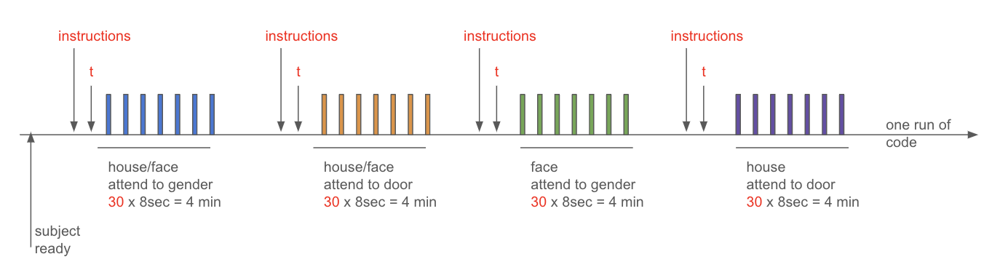
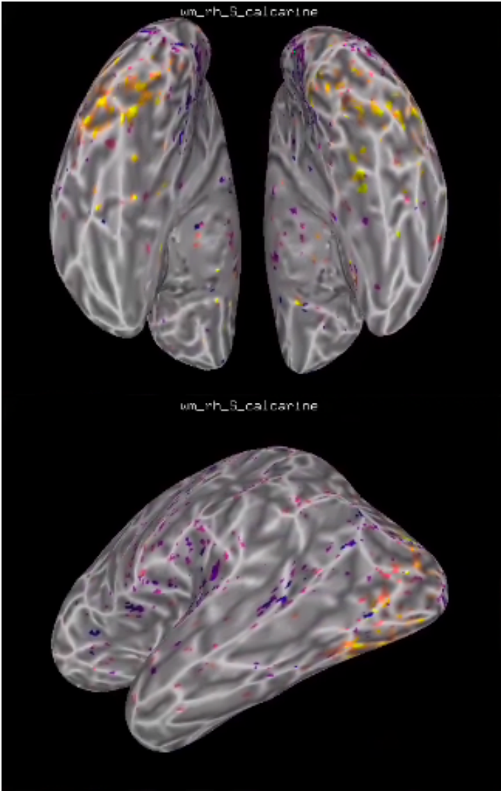

# fMRI Experiment: Attention Modulation in Decay Period After Superimposed Faces and Houses

This repository contains data and analysis for a low-field (3T) and low-resolution (2mm) task-based fMRI experiment. The study investigates how attention modulates perceptual experience and neural activity during the decay period after viewing "double-exposure" images of superimposed faces and houses.

## Experiment Overview

- **Objective**: To determine if attention can modulate perception and neural activity in the decay period following the presentation of superimposed visual stimuli.
- **Stimuli**: Images of human face, house, and those of superimposed faces and houses.
- **Subject**: Normal vision.
- ## Experimental Design

## Schematic Diagram 
| Bistable Period                             | Decaying Period                             | Noise Period                               |
|---------------------------------------------|---------------------------------------------|--------------------------------------------|
|      |      |           |

## Key Findings

1. **GLM Analysis**:
    - The experiment successfully activated the *fusiform face area (FFA)* and the *parahippocampal place area (PPA)*.
    - These findings align with prior research that localized FFA for face recognition and PPA for house recognition.

2. **Attention Modulation**:
    - No significant difference was observed in neural activity in the cued condition when superimposed stimuli were presented.
    - Both FFA and PPA were activated regardless of attention cues, suggesting that attention might not modulate the activity in these areas under these conditions.

##  Visualize using SUMA across different conditions

### Face only:

### House only:

### Face cued:

### House cued:
